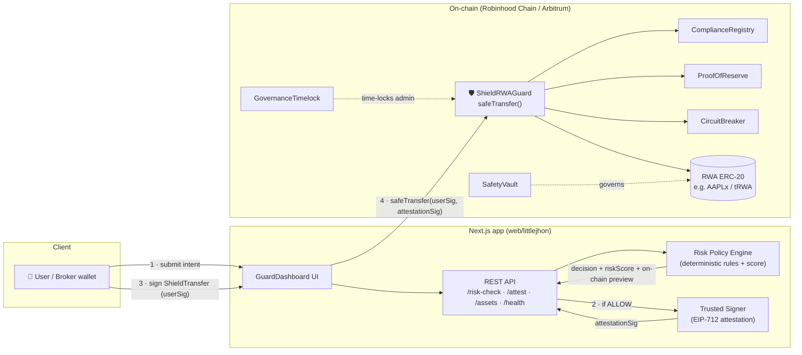
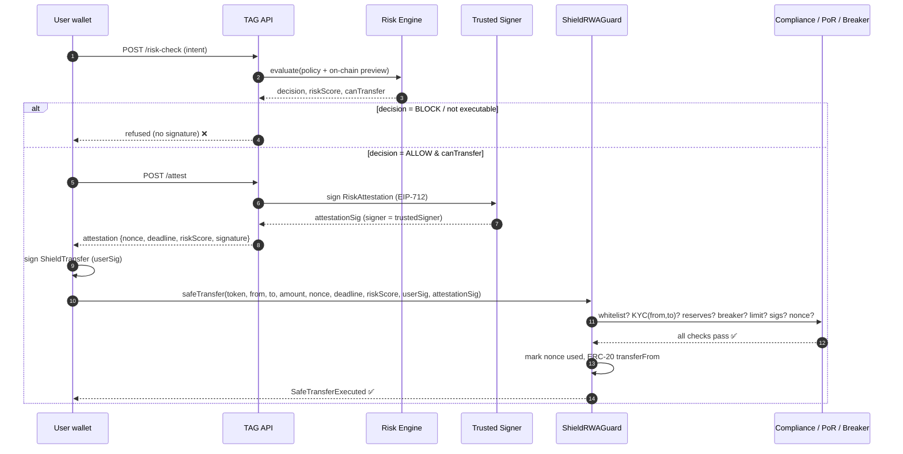

# LittleJhon 🛡️ Tokenized Asset Guard (TAG)

> **A pre-trade safety layer for tokenized real-world assets (RWA).**
> Every transfer is screened by a deterministic risk policy *before* it is signed, then enforced again on-chain by a single guard contract — compliance, proof-of-reserve, circuit breaker, and dual cryptographic signatures, in one `safeTransfer` call.

Built for the **Robinhood Chain** hackathon. Live on **Robinhood Chain Testnet** (`46630`) and **Arbitrum Sepolia** (`421614`) with identical contract addresses.

🔗 **Live demo:** `<add your Vercel URL>` · **Explorer:** [Robinhood Chain Testnet](https://explorer.testnet.chain.robinhood.com) · **Guard contract:** [`0xB4f9…Fd096`](https://explorer.testnet.chain.robinhood.com/address/0xB4f9C2151B73eDEa730A72e9642C971d803Fd096)

---

## The problem

Tokenized stocks (AAPLx, NVDAx, …) put real-world assets on-chain — but a raw ERC-20 `transfer` has **no idea** whether:

- the token is **genuine** or a spoofed look-alike,
- the sender and receiver are **KYC-verified** and in an allowed jurisdiction,
- the asset is still **backed 1:1** by real reserves,
- the market just **crashed** and trading should be halted,
- the user is being tricked into an **unlimited approval** that drains their wallet.

Brokers and wallets that want to offer RWAs have to rebuild this compliance + safety stack themselves, every time. That is slow, error-prone, and the #1 blocker to retail RWA adoption.

## The solution

TAG is a **drop-in safety layer**: a REST API any broker/wallet calls before signing, backed by a set of audited smart contracts that enforce the same rules on-chain. No bespoke integration — call one endpoint, get a decision; call one contract, settle safely.

**Two independent gates. A transfer only settles when both are green.**

| Gate | Where | Question it answers |
|---|---|---|
| **1 — Policy** | `/api/risk-check` (off-chain) | Is this operation *allowed by policy*? → `ALLOW` / `WARN` / `REQUIRE_APPROVAL` / `BLOCK` + a 0–100 risk score |
| **2 — On-chain enforcement** | `ShieldRWAGuard.safeTransfer` | Will the *contract* accept it? Token whitelisted, **sender & recipient KYC-verified**, reserves backed, breaker not halted, amount ≤ limit, **both EIP-712 signatures valid**, nonce unused |

The clever part: the off-chain risk decision is **cryptographically bound** to the on-chain settlement. The backend signs an EIP-712 `RiskAttestation`; the contract verifies that signature (`attestationSig`) against its `trustedSigner`. Policy and settlement can never drift apart.

---

## How it works (architecture)



### The transfer flow, step by step



---

## Use cases (what TAG catches)

These are the exact scenarios verified by the test suite — **5 refused + 1 settled**. Run them yourself: `bash web/littlejhon/hackathon/test-api.sh` (→ *15 passed, 0 failed*).

| # | Scenario | Outcome | Why it matters |
|---|---|---|---|
| ✅ | **Safe transfer** — official asset, KYC sender → KYC recipient | `ALLOW` (risk 12) → **settles on-chain** | The happy path: compliant, backed, signed both ways |
| ❌ | **Sender not KYC-verified** | Policy `ALLOW`, but on-chain `canTransfer:false` → **refused** | Compliance the policy layer can't see, the contract can |
| ❌ | **Fake / spoofed token** | `BLOCK` (risk 96) | Stops look-alike token scams |
| ❌ | **Unlimited approval to unknown spender** | `BLOCK` (risk 94) | Stops wallet-draining approvals |
| ❌ | **Unknown asset** (not in registry) | `BLOCK` (risk 92) | Only screened, curated RWAs settle |
| ❌ | **Ineligible recipient** (restricted asset) | `REQUIRE_APPROVAL` (risk 72) | Enforces transfer restrictions / eligibility lists |

**Beyond the demo:** brokerage RWA settlement, compliant P2P transfers, treasury/OTC desks with policy guardrails, wallet "transaction firewall" before signing, and an auditable compliance trail for regulators.

### Real on-chain proof

The happy path was executed live on Robinhood Chain Testnet:

```
decision: ALLOW · riskScore: 12 · signer: 0x4e5A…AD6D
tx: 0x2ba70d4a32dac2c58bb4d12d4300cd1e27fffd9ac0aa6fdc90587245b2c6e2b0 · success
```

The **negative** paths (replay, risk-too-high, breaker-halted, bad signature) are proven by 113 Foundry tests. See [`E2E-VALIDATION.md`](E2E-VALIDATION.md).

---

## The smart contracts

Six contracts, deployed at **identical addresses** on both testnets (deterministic `CREATE` from nonce 0). Full guide: [`contracts/README.md`](contracts/README.md).

| Contract | Address (RH + Arbitrum) | Responsibility |
|---|---|---|
| **🛡️ ShieldRWAGuard** | `0xB4f9C2151B73eDEa730A72e9642C971d803Fd096` | Orchestrator. `safeTransfer` runs all 12 checks + dual EIP-712 verification + replay protection |
| ComplianceRegistry | `0x5886F06c5cD7eC7E07396D4787fca22A965032C5` | KYC / jurisdiction verification of every counterparty |
| ProofOfReserve | `0x5eD6fe0C2bF02227153CC5482f7d316475a11625` | Verifies reserves ≥ supply via (Chainlink-compatible) PoR feed |
| CircuitBreaker | `0x8A65a9ae5057eB846ce06c1E890f0aB8ADB05777` | Auto-halts a token on price anomalies (>15% deviation) |
| SafetyVault | `0x99D1beDEa8d628b2Bd1Cd136F3348d1d680D6682` | Deposit caps + emergency drain for insured backing |
| GovernanceTimelock | `0x78cce8C167583bf358B3EA1c9C409e13A7Da691a` | 1-day time-lock for admin changes |

Config: `owner` / `trustedSigner` = `0x4e5A…AD6D`, `maxRiskScore` = `75`. Source of truth: [`contracts/src/ShieldRWAGuard.sol`](contracts/src/ShieldRWAGuard.sol), library [`SafetyChecks.sol`](contracts/src/libraries/SafetyChecks.sol).

**`safeTransfer` enforces, in order:** ① token whitelisted ② amount/recipient non-zero ③ deadline ④ nonce unused ⑤ risk score ≤ cap ⑥ trusted signer set ⑦ `userSig` recovers to `from` ⑧ `attestationSig` recovers to `trustedSigner` ⑨ both KYC-verified ⑩ breaker not halted ⑪ reserves backed ⑫ amount ≤ limit.

---

## The page (web app)

A Next.js 16 console (`web/littlejhon`) — "**Shielded RWA transfer console**" — where a user connects a wallet, picks a scenario, runs the risk check, and (for `ALLOW`) executes the guarded transfer end-to-end.

- **REST API** ([`app/api`](web/littlejhon/app/api)): `health`, `assets`, `policies/[id]`, `risk-check`, `attest`
- **Risk engine** ([`server/policies/engine.ts`](web/littlejhon/server/policies/engine.ts)) + asset registry ([`server/assets/registry.ts`](web/littlejhon/server/assets/registry.ts))
- **UI** ([`components`](web/littlejhon/components)): `GuardDashboard`, `ScenarioSelector`, `RiskPanel`, `ExecutionPanel`, `ContractStatus`, `NetworkStatus`, `WalletConnectButton`
- **Wallet/chain**: wagmi + viem ([`lib/blockchain`](web/littlejhon/lib/blockchain))

---

## Quick start (local, Robinhood testnet)

```bash
# 1. Smart contracts
cd contracts && forge test --summary           # 113 tests

# 2. Web + API
cd ../web/littlejhon && pnpm install
cp .env.example .env.local                      # set NEXT_PUBLIC_DEFAULT_CHAIN_ID=46630, addresses,
                                                # and TRUSTED_SIGNER_PRIVATE_KEY (server-only, never NEXT_PUBLIC_)
pnpm dev                                         # http://localhost:3000

# 3. Verify the whole API (no wallet needed)
bash hackathon/test-api.sh                       # 15 cases, PASS/FAIL

# 4. Execute the real on-chain "correct" path
node --env-file=.env.local hackathon/onchain.mjs prepare   # arm breaker + refresh PoR feed
node --env-file=.env.local hackathon/onchain.mjs execute   # attest → sign → safeTransfer
```

> 🔐 **Secrets:** the trusted-signer key lives only in `.env.local` (git-ignored) and is loaded via `--env-file`. Never hardcoded, never `NEXT_PUBLIC_*`.

Docs: [API testing (EN)](web/littlejhon/API-TESTING.md) · [API testing (ES)](web/littlejhon/API-TESTING-ES.md) · [Hackathon test guide](web/littlejhon/hackathon/API-TESTING-HACKATHON.md).

---

## How this meets the hackathon criteria

| Criterion | How TAG delivers |
|---|---|
| **Smart-contract quality** | Single-responsibility contracts, checks-effects-interactions, custom errors, `ReentrancyGuard`, EIP-712, time-locked admin. **113 Foundry tests** (unit + integration + fuzz + invariants). |
| **Product-Market Fit** | A REST API + 6-contract layer any broker/wallet drops in to offer RWAs compliantly — the exact blocker stopping retail RWA today. |
| **Innovation & Creativity** | Off-chain risk decision **cryptographically bound** to on-chain settlement via a verified attestation signature. A "transaction firewall" for RWAs. |
| **Real problem solving** | Provably stops the real retail attacks: spoofed tokens, wallet-draining approvals, non-compliant counterparties, unbacked/halted assets. |

---

## 🧭 North star

> **Become the default safety & compliance layer that every broker, wallet, and chain plugs into before any tokenized-asset transfer settles — the "Stripe Radar + Plaid" for on-chain RWAs.**

If issuing and trading tokenized stocks is going to be as normal as buying them in an app, *someone* has to guarantee each transfer is genuine, compliant, backed, and safe — without each player rebuilding it. TAG is that neutral, verifiable layer: open standards (EIP-712, Chainlink feeds), multi-chain, and policy-as-code that regulators and auditors can read.

---

## 🗺️ Roadmap

### Q2 2026 — Hackathon baseline (done ✅)
- 6 contracts deployed on Robinhood Chain + Arbitrum Sepolia, 113 tests, live E2E
- REST API (risk-check, attest, assets, health) + transfer console
- Dual EIP-712 enforcement, replay protection, circuit breaker, proof-of-reserve
- Curl test suite (15 cases) + on-chain execution helper

### Q3 2026 — Production hardening
- **Real Chainlink feeds**: swap mock oracles for live Price + Proof-of-Reserve feeds; **Chainlink Automation / Gelato** keeper to auto-trigger the breaker
- **Real KYC integration**: pipe **Persona / Sumsub / Plaid Identity** results into `ComplianceRegistry`; OFAC/sanctions screening via **Chainalysis / TRM Labs**
- **Governance**: transfer ownership of all contracts to `GovernanceTimelock` + a **Safe multisig**; publish admin runbooks
- **Security**: external audit, **OpenZeppelin Defender / Tenderly** monitoring + alerting on the relayer and breaker

### Q4 2026 — Developer adoption
- **TypeScript SDK** + embeddable **"Guarded Transfer" widget** so any broker integrates in hours
- **Webhooks + audit-log export** (SIEM / compliance officer console)
- **Account abstraction (ERC-4337)**: gasless, sponsored, batched guarded transfers
- **Attestation marketplace**: pluggable risk engines; ML-based scoring alongside deterministic rules
- Expand to **Robinhood Chain mainnet, Base, and Ethereum L1**

### 2027 — Network effects
- **On-chain insurance** via `SafetyVault` payouts for covered failures
- **Cross-chain guarded settlement** (CCIP) so a transfer is screened once and settles anywhere
- **Compliance analytics** + regulator-facing reporting dashboards
- Open the policy registry so issuers publish and version their own `policyId`s

---

## Repository structure

```
.
├── contracts/                 # Foundry project (Solidity 0.8.24)
│   ├── src/                   # ShieldRWAGuard + 5 core contracts + libs
│   ├── test/                  # 113 tests (unit, integration, fuzz, invariant)
│   ├── script/                # Deploy.s.sol, E2EFlow.s.sol
│   └── deployments/           # RH + Arbitrum address records
├── web/littlejhon/            # Next.js 16 app + REST API
│   ├── app/api/               # health, assets, policies, risk-check, attest
│   ├── server/                # policy engine, asset registry, attestation, blockchain
│   ├── components/            # GuardDashboard + panels
│   └── hackathon/             # test-api.sh, onchain.mjs, API-TESTING-HACKATHON.md
└── E2E-VALIDATION.md          # live on-chain evidence
```

## License

MIT.
